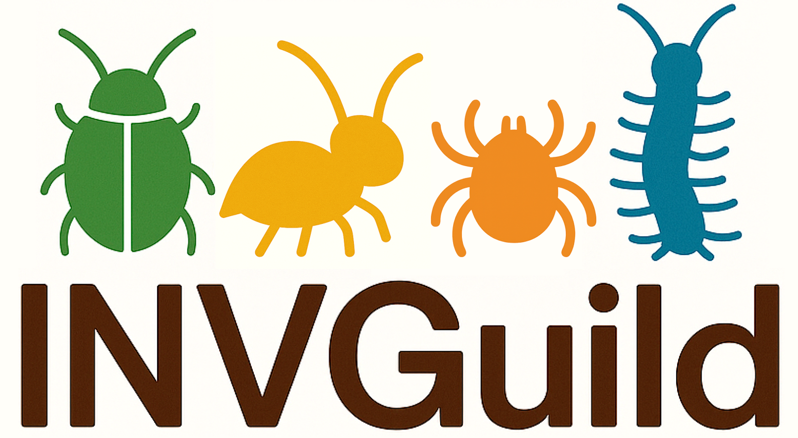

# INVGuild

**INVGuild** is an open-access, expandable reference database that links terrestrial invertebrate taxa to trophic guilds, enabling functional interpretation of biodiversity data. Developed through an extensive literature review, INVGuild addresses the need for functional trait information in biodiversity surveys, especially for species-rich and taxonomically complex groups like invertebrates.

## Why INVGuild?

Understanding ecosystem functioning requires more than just knowing which species are present, it requires insight into what roles those species play. Traditional taxonomic diversity metrics often fall short in capturing ecological dynamics. Functional diversity, by contrast, reflects ecological processes more directly. However, assigning functional roles (e.g., feeding strategies) to invertebrates in large-scale surveys is notoriously difficult.

**INVGuild** bridges this gap by offering a **curated and structured database to assign invertebrate taxa to one of seven trophic guilds (bacterivores, carnivores, detritivores, fungivores, herbivores, microbivores, omnivores)**, making functional analysis accessible and scalable for ecological studies and biodiversity monitoring efforts.

## Scope and Development

The INVGuild database was developed from a curated list of terrestrial invertebrates identified in large-scale soil biodiversity studies.

To ensure reliability:

* Taxa names were standardized following NCBI taxonomy.
* Invalid or unrecognized names were excluded.
* Trophic roles were assigned based on accurate literature review.
* Assignments were made only when trophic roles were consistent across all members of a taxonomic group.

## Database Contents

* **973 taxonomic entries with functional assignment**
  * 659 species
  * 232 genera
  * 71 families
  * 8 orders
  * 3 classes

* Including representatives of **21 invertebrate classes**, **76 orders**, **387 families**
* **585 bibliographic sources** support trophic assignments
* For each entry besides the assigned **trophic guild** also the **taxonomic level of the assignment**, the **bibliographic references**, and some **ecological notes** are reported

## How to use INVGuild
[tutorial (html version)](https://montagnalab.github.io/INVGuild/INVGuild_TrophicGuildAssignment.html)

[tutorial (Rmd version)](INVGuild_TrophicGuildAssignment.Rmd)

## Citation

If you use INVGuild in your work, please cite the corresponding publication:

> *In evaluation*.

[Code for bioinformatic analysis of the paper](INVGuild_code_Bioinformatic_Pipeline.md)
